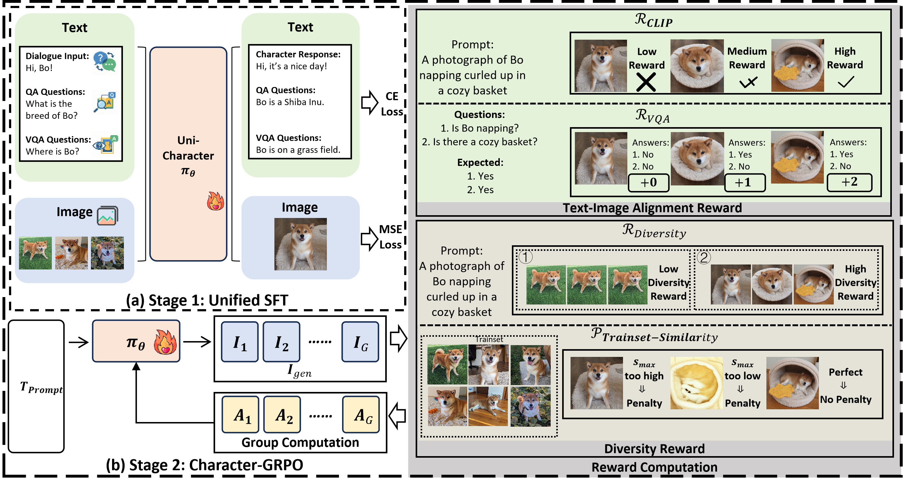
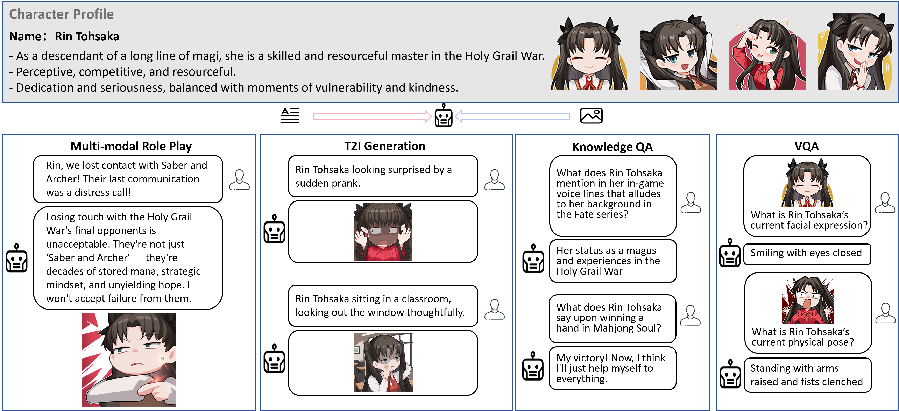
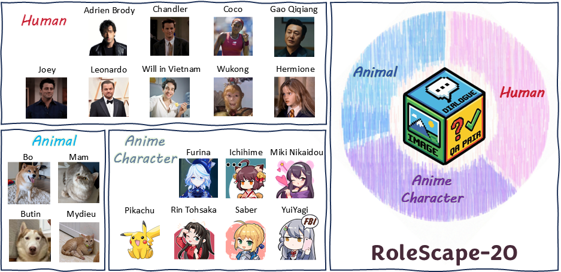

<p align="center">
  
</p>
<p align="center">
  <h1 align="center">Towards Customized Multimodal Role-Play</h1>
  <p align="center">
    <br />
    <a href="https://tangc03.github.io/"><strong>Chao Tang</strong></a>
    ·
    <a href="https://jianzongwu.github.io"><strong>Jianzong Wu</strong></a>
    ·
    <a href="https://github.com/Shi-qingyu"><strong>Qingyu Shi</strong></a>
    ·
    <a href="https://tyfeld.github.io/"><strong>Ye Tian</strong></a>
    ·
    <a href="https://scholar.google.com/citations?user=hNTP47EAAAAJ&hl=en"><strong>Aixi Zhang</strong></a>
    ·
    <a href="https://scholar.google.com/citations?user=0TvdOEcAAAAJ&hl=en"><strong>Hao Jiang</strong></a>
    ·
    <a href="https://scholar.google.com/citations?user=2hA4X9wAAAAJ&hl=en"><strong>Jiangning Zhang</strong></a>
    ·
    <a href="https://scholar.google.com/citations?user=T4gqdPkAAAAJ"><strong>Yunhai Tong</strong></a>
  </p>
<br />

<div align="center">

[]()
[](https://tangc03.github.io/UniCharacter.github.io/)
[](https://huggingface.co/datasets/Tangc03/RoleScape20)
[](https://huggingface.co/Tangc03/UniCharacter)
[](https://youtu.be/EVWa3bflwkA)

</div>

Official implementation of Towards Customized Multimodal Role-Play.

## 🚀 TL;DR

- **Task**: We propose Customized Multimodal Role-Play (**CMRP**) — jointly customizing a character's **persona**, **dialogue style**, and **visual identity** in multimodal interactions, while maintaining cross-modal consistency.  
- **Dataset**: We build **RoleScape-20** (20 characters), covering persona dialogue, character visual representation, text-to-image interaction, and both visual and knowledge QA for training and evaluation.  
- **Method**: Based on a unified multimodal model, we propose a two-stage framework **UniCharacter**: Unified-SFT + Character-GRPO, which enhances cross-modal consistency and few-shot customization.  
- **Few-shot customization**: With only **10 character images** and corresponding interaction examples, the model can learn the target character in both text and image generation, and keep them coherent.  
- **Results**: UniCharacter significantly outperforms existing methods on RoleScape-20; ablations validate the effectiveness of cross-modal consistency design and few-shot strategies.  

## 📋 Table of Contents

- [Open-source Plan](#Open-source-plan)
- [Features](#features)
- [Quick Start](#quick-start)
- [Training Guide](#training-guide)
- [Project Structure](#project-structure)
- [Acknowledgements](#acknowledgements)
- [Contact](#contact)
- [Citation](#citation)

## 📑 Open-source Plan

- UniCharacter
  - [x] Inference code
  - [x] RoleScape-20 dataset
  - [x] Training code
  - [ ] UniCharacter checkpoints
  - [ ] Gradio demo
  - [ ] Data annotation pipeline

## ✨ Features
<p align="center">
  
</p>

UniCharacter provides rich multimodal role-play capabilities:

- **🎭 Multimodal Role-play**
  - Jointly generates character dialogue and character images
  - Supports image-grounded dialogue while keeping persona and style consistent

- **🧑‍🎨 Role T2I Generation**
  - Given character settings and text description, generates character images that match persona and appearance

- **🔍 Visual Understanding**
  - Visual Question Answering (VQA)
  - Image content understanding and analysis

- **💬 Knowledge QA**
  - Question answering based on character-related knowledge

<p align="center">
  
</p>

RoleScape-20 provides multimodal role-play, visual QA, and knowledge QA data for 20 characters, covering humans, animals, and anime characters.

<p align="center">
  
</p>

## 🚀 Quick Start

### Installation

1. **Clone the repository**
```bash
git clone <repository-url>
cd UniCharacter
```

2. **Install dependencies**

Choose the dependency set according to your use case:

**Stage1: SFT training**:
```bash
conda create -n unicharacter-sft python=3.10
pip install -r requirements_sft.txt
```

**Stage2: GRPO training**:

Download [flash_attn-2.7.4.post1+cu12torch2.6cxx11abiFALSE-cp310-cp310-linux_x86_64](https://github.com/Dao-AILab/flash-attention/releases/download/v2.7.4.post1/flash_attn-2.7.4.post1+cu12torch2.6cxx11abiFALSE-cp310-cp310-linux_x86_64.whl)

```bash
conda create -n unicharacter-grpo python=3.10
git clone https://github.com/open-mmlab/mmcv.git
# If you have network issues you can use:
# git clone https://gitee.com/mirrors/mmcv.git
cd mmcv && git checkout 1.x && cd ..
pip install -r requirements_grpo.txt
```

3. **Download base model**

Place BAGEL-7B-MoT in the `models/BAGEL-7B-MoT/` directory and ensure it contains the following files:
- `llm_config.json`
- `vit_config.json`
- `ae.safetensors`
- `ema.safetensors`
- other necessary model files

```python
from huggingface_hub import snapshot_download

save_dir = "models/BAGEL-7B-MoT"
repo_id = "ByteDance-Seed/BAGEL-7B-MoT"
cache_dir = save_dir + "/cache"

snapshot_download(cache_dir=cache_dir,
  local_dir=save_dir,
  repo_id=repo_id,
  local_dir_use_symlinks=False,
  resume_download=True,
  allow_patterns=["*.json", "*.safetensors", "*.bin", "*.py", "*.md", "*.txt"],
)
```

4. Download fine-tuned checkpoints


### Quick usage example

**Python API (Unified inference interface UniCharacterInference)**:
```python
from inference import create_unicharacter_inference
from pathlib import Path

# Initialize the unified inference (modify paths according to your environment)
inference = create_unicharacter_inference(
    model_path="models/BAGEL-7B-MoT",
    checkpoint_path="<checkpoint_path>",
    vit_checkpoint_path="<vit_checkpoint_path>",
    max_mem_per_gpu="40GiB",
    seed=42,
)

out_dir = Path("test_images/outputs")
out_dir.mkdir(parents=True, exist_ok=True)

# 1) Text-to-image generation (Role T2I)
res = inference.generate_image("Ichihime chasing a butterfly")
res["image"].save(out_dir / "t2i_ichihime.png")

# 2) Visual understanding / VQA
res = inference.visual_understanding(
    "data/personalized_data/train/Mahjong Soul-Ichihime/1.png",
    "What's the color of Ichihime's hair?",
)
print("VQA:", res["text"])

# 3) Knowledge QA
res = inference.knowledge_qa("When do you born?")
print("Knowledge QA:", res["text"])

# 4) Multimodal role-play
res = inference.role_play(
    character_name="Ichihime",
    description="",
    opening="",
    user_text="Hi, Ichihime. How are you?",
)
print("Role-play:", res["response"])
```

## 🎓 Training Guide

**Stage1: Unified-SFT**:
```bash
# Multi-node training settings
export num_nodes=1              # number of nodes
export node_rank=0              # rank of current node
export master_addr="localhost"  # master node address
export master_port="21355"      # master node port

export model_path="models/BAGEL-7B-MoT"

export CUDA_VISIBLE_DEVICES=0,1,2,3

export PYTHONPATH=UniCharacter:$PYTHONPATH && echo "PYTHONPATH set to: $PYTHONPATH"

torchrun \
  --nnodes=$num_nodes \
  --node_rank=$node_rank \
  --nproc_per_node=4 \
  --master_addr=$master_addr \
  --master_port=$master_port \
  pretrain_unified_navit_fixed.py \
  --dataset_config_file "<dataset_config_path>" \
  --model_path $model_path \
  --layer_module Qwen2MoTDecoderLayer \
  --max_latent_size 64 \
  --resume-from "models/BAGEL-7B-MoT" \
  --finetune_from_hf True \
  --auto_resume False \
  --resume-model-only True \
  --finetune-from-ema True \
  --log_every 10 \
  --lr 2e-5 \
  --num_worker 1 \
  --expected_num_tokens 8192 \
  --max_num_tokens 12288 \
  --max_num_tokens_per_sample 8192 \
  --num_shard 4 \
  --wandb_name <wandb_name> \
  --total_steps 501 \
  --warmup_steps 0 \
  --cpu_offload True \
  --checkpoint_dir <sft_checkpoint_path> \
  --save_every 500
```

**Stage1: Unified-SFT checkpoint post-processing**
```bash
bash ckpt_processing/ckpt_processing.sh --ckpt_dir "<sft_checkpoint_path>/<model_name>/<step>/model"
```

**Stage2: Character-GRPO**:

First modify `dataset`, `save_dir`, and `run_name` in `personalized_t2i_bagel_full.yaml` as needed.  
Dataset-related files are under `flow_grpo/dataset/personalized_t2i/<character_folder>`.

```bash
cd flow_grpo
python scripts/multi_node/bagel/train.py \
    --GPUS_PER_NODE 8 \
    --MASTER_PORT 0 \
    --config config/grpo.py:personalized_t2i_bagel \
    --yaml_config personalized_t2i_bagel_full.yaml \
    --checkpoint_path <sft_checkpoint_path>/<model_name>/<step>/model.safetensors
```

## 📁 Project Structure

```
UniCharacter/
├── data/                    # data processing
│   ├── config
│   ├── personalized_data
│   ├── dataset_info.py     # dataset metadata
│   └── ...
├── modeling/               # model definitions
├── flow_grpo/             # GRPO training pipeline
│   ├── config/            # training configs
│   ├── flow_grpo/         # GRPO core code
│   └── scripts/           # training scripts
├── train/                  # training utilities
│   ├── train_utils.py     # training helper functions
│   └── ...
├── inference.py            # unified inference interface
├── inference_grpo.py       # GRPO inference interface
├── personalize_inference_grpo.py # GRPO personalized inference interface
├── inferencer.py           # low-level inferencer implementation
├── requirements_sft.txt    # SFT dependencies
├── requirements_grpo.txt   # GRPO dependencies
├── setup.py                # installation config
└── README.md               # this document
```

## 🙏 Acknowledgements

- [BAGEL](https://github.com/ByteDance-Seed/Bagel)
- [Flow-GRPO](https://github.com/yifan123/flow_grpo)

## 📧 Contact
For questions or suggestions, please open an Issue or contact Chao Tang (tc_2003@stu.pku.edu.cn)

## 📜 Citation
